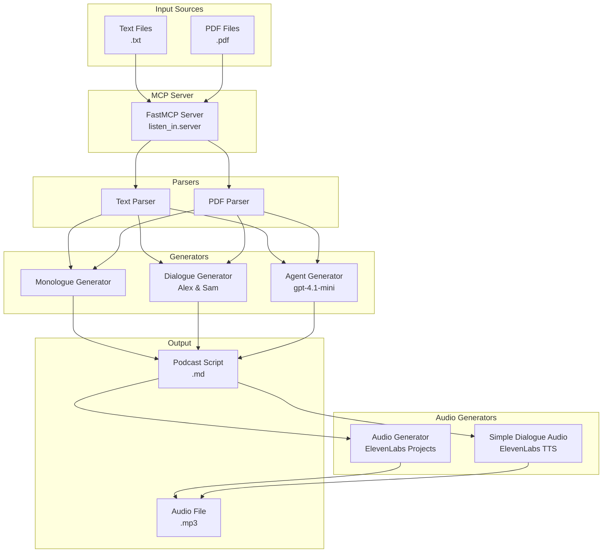

# Listen-in Architecture

## System Overview

## Component Details

### Input Layer
- **Text Files**: Plain text documents (.txt)
- **PDF Files**: PDF documents with text extraction

### Parsing Layer
- **TextParser**: Extracts content, metadata, and structure from text files
- **PDFParser**: Uses pdfplumber/PyPDF2 to extract text from PDFs

### Generation Layer
- **MonologueGenerator**: Single-host podcast scripts
- **DialogueGenerator**: Two-host conversations with Alex (enthusiastic) and Sam (witty expert)
- **AgentGenerator**: Uses OpenAI Agents SDK with structured output

### Audio Layer
- **AudioGenerator**: Uses ElevenLabs Projects API for complex productions
- **SimpleDialogueAudioGenerator**: Direct TTS API for dialogue scripts

### Output Layer
- **Podcast Scripts**: Markdown files with metadata and formatted content
- **Audio Files**: MP3 files generated from scripts
</content>
</invoke>